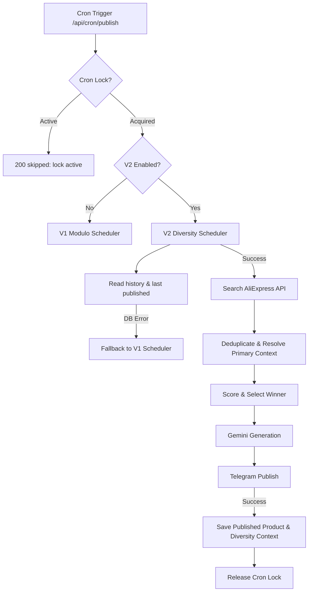

# Discovery V2 Staging Guide & Operational Readiness

This document outlines the architecture, setup, environment, manual validation, rollback protocols, and troubleshooting paths for the first staging deployment of Discovery Engine V2.

---

## 1. Architecture Overview
Discovery Engine V2 introduces category-aware search scheduling, search history cooldowns, and publication frequency diversity. It operates inside a fail-closed concurrency lock block to prevent duplicate executions across serverless containers.



---

## 2. Environment Variables Reference

| Variable | Required | Default | Used In | Purpose | Security |
|---|---|---|---|---|---|
| `DISCOVERY_V2_ENABLED` | Optional | `false` | `discovery-scheduler.ts` | Set `"true"` to enable category-aware scheduler. | Public / Config |
| `DRY_RUN` | Optional | `false` | `discovery-scheduler.ts` | Set `"true"` to bypass Telegram posts and DB writes. | Public / Config |
| `CRON_LOCK_TTL_SECONDS` | Optional | `900` | `route.ts` | Lock lease duration (seconds) for concurrent run prevention. | Public / Config |
| `ALIEXPRESS_APP_KEY` | Required | - | `config.ts` (AliExpress) | API app key for developer gateway access. | Secret / Credential |
| `ALIEXPRESS_APP_SECRET`| Required | - | `config.ts` (AliExpress) | Signing secret for request validation. | Secret / Credential |
| `ALIEXPRESS_TRACKING_ID`| Required | - | `config.ts` (AliExpress) | Affiliate tracking ID for purchase commission. | Public / Identifier |
| `GEMINI_API_KEY` | Required | - | `gemini-provider.ts` | Gemini generative language model API token. | Secret / Credential |
| `TELEGRAM_BOT_TOKEN` | Required | - | `telegram-provider.ts` | Bot access token for sending Telegram posts. | Secret / Credential |
| `TELEGRAM_CHANNEL_ID` | Required | - | `telegram-provider.ts` | Target Telegram channel handle or ID. | Public / Identifier |
| `SUPABASE_URL` | Required | - | `config.ts` (Supabase) | API endpoint URL for database connection. | Public / Identifier |
| `SUPABASE_SECRET_KEY` | Required | - | `config.ts` (Supabase) | Bypass RLS key for database CRUD operations. | Secret / Credential |
| `CRON_SECRET` | Required | - | `route.ts` | Bearer token secret to authorize cron hits. | Secret / Credential |

---

## 3. Staging Deployment Checklist

### Step 1: Database Migration
Apply migrations to the target database in sequence:
1.  **V2 Diversity History Migration**: `docs/project/migrations/v2_diversity_scheduler.sql`
2.  **V3 Cron Lock Migration**: `docs/project/migrations/v3_cron_locks.sql`

Verify that:
*   Tables `discovery_run_history`, `published_product_diversity`, and `cron_locks` are present.
*   RPC functions `try_acquire_cron_lock` and `release_cron_lock` are registered in Supabase.

### Step 2: Environment Settings Configuration
Configure the following env variables in your staging host (e.g. Vercel / Netlify):
*   `DISCOVERY_V2_ENABLED=false` (Keep V1 as baseline first).
*   `DRY_RUN=true` (Protect staging environment from executing actual postings / database insertions first).
*   `CRON_LOCK_TTL_SECONDS=900`.
*   All required credentials (`ALIEXPRESS_*`, `GEMINI_*`, `TELEGRAM_*`, `SUPABASE_*`, `CRON_SECRET`).

### Step 3: CI/CD Build & Verification
1.  Run the linter check: `npm run lint`
2.  Compile build: `npm run build`
3.  Run unit and E2E simulation suites: `npx tsx scripts/test-discovery.ts`

### Step 4: Health & Endpoint Verification
Trigger the cron endpoint `/api/cron/publish` manually via curl or Postman:
```bash
curl -X GET https://<staging-app-url>/api/cron/publish \
  -H "Authorization: Bearer <CRON_SECRET>"
```
*   Verify it returns status code `200` with `"status": "no-products"` (if dry-run/empty results) or successful selection metrics.

---

## 4. Manual Verification Flow (Dry Run Smoke Tests)

Perform this manual smoke test to verify V2 scheduler routing:
1.  Temporarily set `DISCOVERY_V2_ENABLED=true` and `DRY_RUN=true` in staging.
2.  Trigger the endpoint `/api/cron/publish`.
3.  Verify the console log output contains:
    ```text
    Scheduled product discovery started. Mode: DRY_RUN, Scheduler: V2
    [CronLock] Lock acquired. key="affiliate-publish-cron" ownerId=...
    [DiversitySchedulerV2] schedulerVersion=V2 strategiesCount=3 selectedCategories=[...] selectedKeywords=[...]
    [CronLock] Lock released status. key="affiliate-publish-cron" released=true
    ```
4.  Confirm response returns HTTP status code `200` with the selected product title and code `PRODUCT_PROCESSED_DRY_RUN`.

---

## 5. Rollback Procedure
If any failures occur in staging or production, rollback instantly by setting the environment variable:
```bash
DISCOVERY_V2_ENABLED=false
```
*   **No code deployments or rebuilds are required.**
*   The system immediately reverts to the V1 scheduler logic.

---

## 6. Common Troubleshooting

### Lock Active (HTTP 200 skipped)
*   **Cause**: A previous execution crashed and left the lock active, or concurrent requests were received.
*   **Fix**: Wait for the 15-minute lease to expire, or delete the row manually in the `cron_locks` table in Supabase.

### V1 Fallback Logging
*   **Cause**: Database failure when fetching history.
*   **Fix**: Verify Supabase database endpoint health, network connection, or correct credentials. The pipeline executes using V1.
